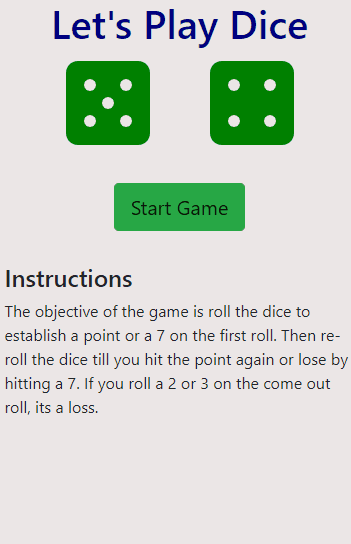
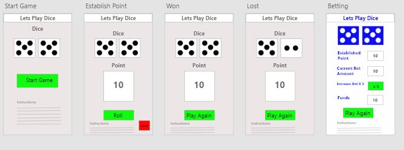

# Dice

 

### Table of Contents
1. Purpose
2. Motivation
3. Objectives
4. Wireframe
5. Technologies Used

### Purpose:
A traditional Dice game built as web application. 

### Motivation:
The goal was to practice building React web apps, creating wire-frames with Adobe XD, and learning CSS animations. 

### WireFrame
 

### How to Play:
* The user first roll of the dice establishes the point or number the user must roll again to win.
* The user then continue to reroll the dice over and over until point is hit (a win) or the user roll a seven (a loss). 

### This app was built with the following technologies:
**React:** JavaScript front-end library for building user interfaces
 
**Git-Hub:** Web-based version control repository and Internet hosting service
 
**Bootstrap:** A CSS based layout technology for building responsive websites

**Abode XD** A wire-framing tool used to create a mockup/visual of what is to be coded
  
**JavaScript:** Object-oriented programming language for web pages
 
**HTML:** Mark-up language for creating web pages 
 
**CSS:** A formatting language for styling web pages
 
*Create by JC Smiley in May of 2019*